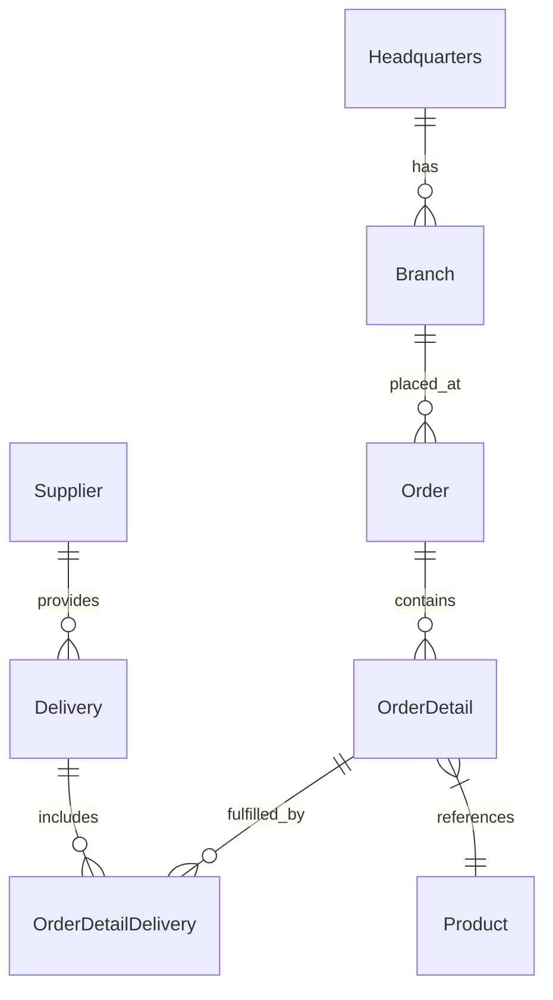
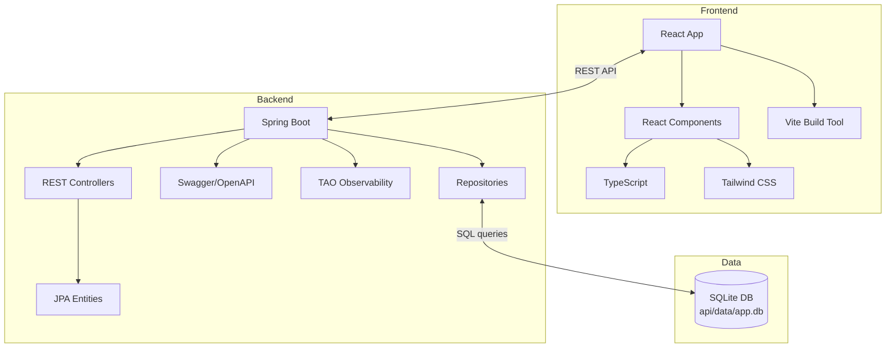

# OctoCAT Supply Chain Management System Architecture

This site is a demo application with a Java backend and TypeScript frontend. The entire app was created originally from an [ERD diagram](../api/ERD.png) and natural language prompts using Copilot. The frontend was created in the same way, using some of the design ideas in [the design folder](./design/).

The hero image and product images were created by prompting ChatGPT!

## Architecture Overview

The system is a modern supply chain management application with a Java backend and TypeScript frontend, comprising a REST API and a React frontend. It's designed to demonstrate Copilot capabilities using a fairly typical architecture with a little complexity, but not enough to derail demos!

### Backend Architecture
- Spring Boot REST API with controllers for all entities
- Spring Data JPA repositories with SQLite persistence
- Schema migrations and seed data managed via SQL files
- Swagger/OpenAPI documentation integration
- JPA entities with proper relationships following an ERD diagram

### Frontend Architecture
- React 18+ with TypeScript
- Vite build tool for fast development
- Tailwind CSS for UI styling

### DevOps Integration
- Docker/Docker Compose for containerization
- Optional Bicep + GitHub Actions plan for Azure deployment

## ERD

## Component Architecture

## Key Features

- Complete REST APIs for all supply chain entities
- SQLite-backed persistence with foreign keys and indexed queries
- Declarative migrations (docs/sql/migrations) and deterministic seed data
- Detailed OpenAPI documentation, generated by Copilot
- Modern React UI with responsive design, generated by Copilot using images
- Containerization for consistent deployment, generated by Copilot

## Persistence and Data Model

- Database: SQLite (file located at `api/data/app.db` by default; configurable via `DB_FILE`)

- Access: repository layer with camelCase Java models mapped to snake_case columns

- Migrations: SQL scripts in `api/sql/migrations` executed in order and tracked in a `migrations` table
- Seeding: ordered SQL scripts in `api/sql/seed` to bootstrap demo data
- Test mode: in-memory database (`:memory:`) for fast and isolated tests

See the dedicated guide: `docs/sqlite-integration.md`.
